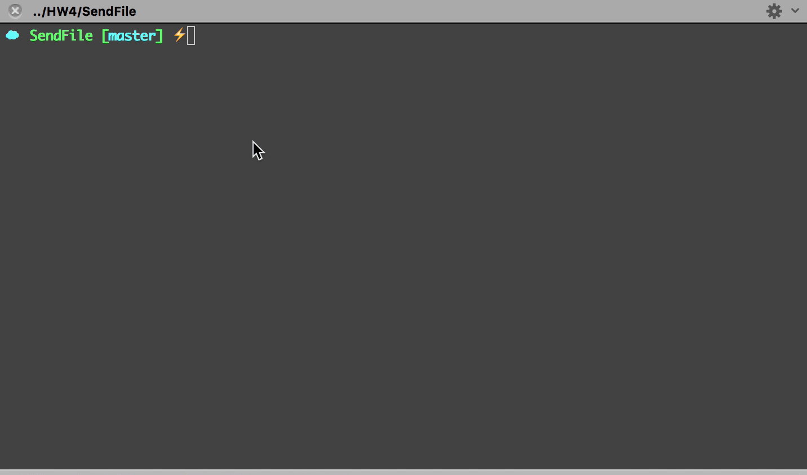
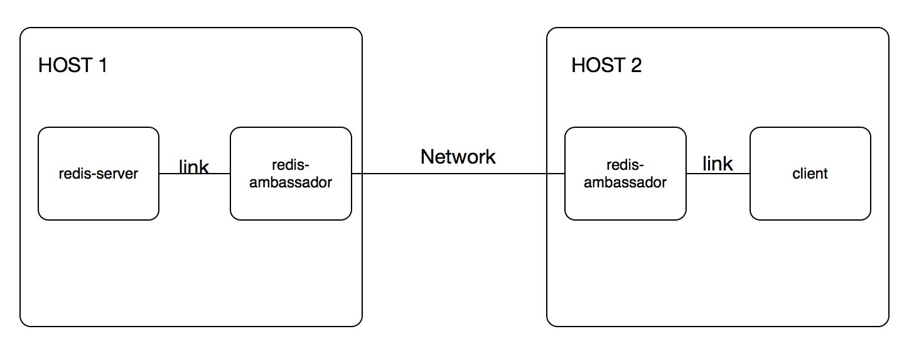
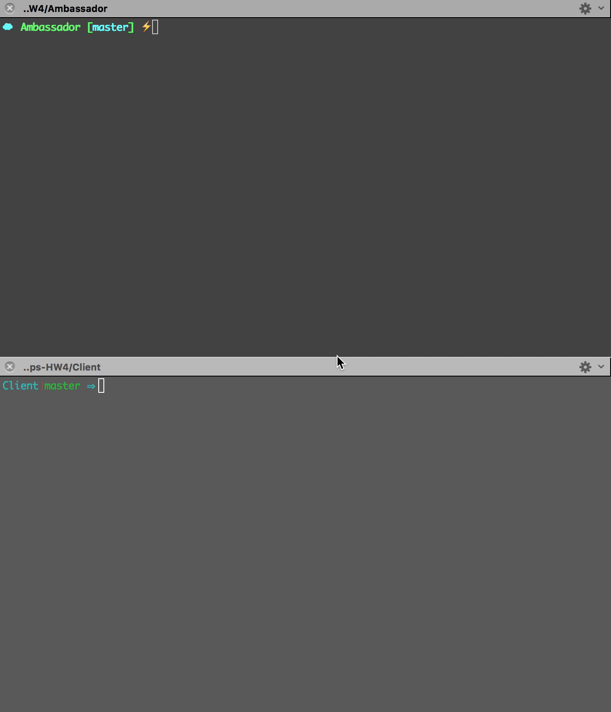

# DevOps-HW4
##File IO
In this part, I created two containers, one for sending file, one for receiving file. Dockerfile for sending 
is like this:
```
FROM    ubuntu:14.04
RUN     apt-get update && apt-get install -y socat
EXPOSE  9001
RUN echo "Hello world, this is a container" > foo.txt
CMD ["socat", "TCP-LISTEN:9001,reuseaddr,fork", "SYSTEM:'cat foo.txt'"]
```

It will create a text file "foo.txt", and use `socat` to map it to port 9001. Build and run the container 
by command:
```
docker build -t sendfile .
docker run -it -d --name sendfile sendfile
```
Next, for the receiving file container, the Dockerfile is simple:
```
FROM    ubuntu:14.04

RUN apt-get update
RUN apt-get -y install curl
CMD ["curl", "sendfile:9001"]
```
Build and run the `getfile` container:
```
docker build -t getfile .
docker run -it --rm --name getfile --link sendfile:sendfile getfile
```
As runing container with command `--link`, it will automatically set the `/etc/hosts` file, so in the `curl` command 
we can use `sendfile` to replace the IP address. In this way, the `getfile` container will print out the content of the text file 
`foo.txt` in the `sendfile` container.

It should work like this:


##Ambassador pattern
In this part, I used 4 containers in total, they have a structure like this:


In `HOST 1`, I use a `docker-compose.yml` to build and run the two containers: redis-server and 
redis-ambassador. Installing [docker-compose](https://docs.docker.com/compose/install/) and then use command 
`docker-compose up -d` to lanuch these two containers.
```
docker-compose.yml:

redis_ambassador:
  container_name: redis_ambassador
  links:
   - redis
  ports:
   - "6379:6379"
  image: svendowideit/ambassador
redis:
  container_name: redis
  image: redis
```

In `HOST 2`, also use a `docker-compose.yml` to generate required contaniers. Here I have a redis-ambassador 
and a client which need to get access to the redis-server in HOST 1. And using the command `docker-compose run client` to launch 
these two containers and open a `redis-cli` for communicating with the redis-server in HOST 1.

It works like this:

##Docker Deploy
In this part, I use a `post-commit` hook to trigger the build container, and use `post-receive` hook for deploying the app to blue and green slice. 
The total structure is like this:
```
- Deploy/
      - App/
	  - blue.git/
	  - green.git/
	  - Dockerfile
```

In `blue.git` and `green.git`, initiate a bare repository by command `git init --bare`. Use these two commands:
```
git remote add blue Deploy/blue.git
git remote add green Deploy/green.git
``` 
to add the blue and green repositoreis as the remote of the original git repository. 

And in the original git repository, use a `post-commit` hook to do the build docker and push to local registry:
```
#!/bin/bash

echo "-----------------Build Dockerfile-----------------"
cd Deploy
docker build -t hw4-app .

echo "---------------------Run app----------------------"
docker run -p 3000:8080 -d --name app hw4-app

echo "-----------------Push to registry-----------------"
docker tag hw4-app localhost:5000/hw4:latest
docker push localhost:5000/hw4:latest
```

Then, in the blue and green repository, use a `post-receive` hook to do the pull from registry and launch the corresponding apps:
```
post-receive in blue.git

#!/bin/bash
echo "------------------deploy to blue slice----------------"
docker pull localhost:5000/hw4:latest
docker stop app-blue
docker rm app-blue
docker rmi localhost:5000/hw4:current
docker tag localhost:5000/hw4:latest localhost:5000/hw4:current
docker run -p 3001:8080 -d --name app-blue localhost:5000/hw4:latest

post-receive in green.git

#!/bin/bash
echo "------------------deploy to green slice----------------"
docker pull localhost:5000/hw4:latest
docker stop app-green
docker rm app-green
docker rmi localhost:5000/hw4:current
docker tag localhost:5000/hw4:latest localhost:5000/hw4:current
docker run -p 3002:8080 -d --name app-green localhost:5000/hw4:latest
```

Thus, the whole deployment procedure works like this:
1. Perfomr a `git commit` then it will trigger the `post-commit` hook, it will build the app and push to the local registry.
2. `git push` to the blue or green repository, it will trigger the `post-receive` hook in the target repo, and deploy the corresponding app. 